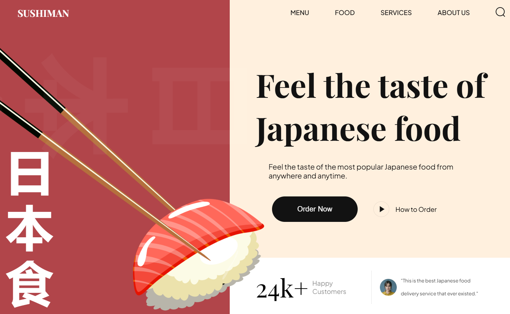

# 🍣 Sushi Website – Learning Project

> A beginner-friendly sushi restaurant website built using **HTML5** and **CSS3** as part of my front-end learning journey.

---

## 📚 Purpose

This project was created purely for educational purposes to practice:
- Writing semantic HTML
- Styling using modern CSS
- Structuring a responsive layout
- Understanding basic animation and positioning techniques

I followed an existing tutorial to **recreate the website step-by-step**, which helped me understand core front-end concepts better.

---

## 🛠️ Technologies Used

- HTML5  
- CSS3  
- Vite (for fast development server)

---

## 💡 What I Learned

- How to structure multi-section web pages  
- Using **Flexbox** and **Positioning** for layout  
- Organizing CSS using modular files  
- Applying **media queries** for responsive design  
- Adding smooth and subtle **UI animations**  
- Following naming conventions like **BEM** for better CSS structure  

---

## 🚀 Getting Started

To run this project locally:

```bash
# 1. Clone the repository
git clone https://github.com/your-username/sushi-website-learning.git
cd sushi-website-learning

# 2. Install the dependencies
npm install

# 3. Start the development server
npm run dev
```

Then open your browser and go to `http://localhost:5173`.

---

## 📸 Preview




---

## 🙏 Credits

This project is a **learning-based clone** of [JavaScript Mastery's Sushi Website](https://github.com/adrianhajdin/project_html_css_website).

All design, layout, and assets are credited to the original creators.  
This repository was made **solely for educational purposes** to practice front-end development with HTML and CSS.

---